# Co:OPERATE - Building with purpose, building for all

### Introducing SocialConnect and rediscovering Celo's fee currency feature

<!-- Speaker: Arthur Gousset
Date: Wed, Jul 19 2023 -->

---
# Part 1: Rediscovering Celo's fee currency feature

<!-- +	You can pay gas fees in ERC20 tokens like cUSD, cEUR, cREAL
+	Any token added to `FeeCurrencyWhitelist.sol` -->

---
## Abstracting the concept of gas currencies

+	User experience with native tokens: `CELO`, `ETH`, ...
+	User experience with stabletokens `cUSD`, `cEUR`, ...

---
## Get started using fee currencies

```ts
import 'viem' from "viem"
import { celo } from "viem/chains"
import { stableTokenABI } from "@celo/abis"
```

```ts
const transaction = {
    from: account.address,
    to,
    value: parseEther(value),
    feeCurrency: FEE_CURRENCIES["cusd"],
  }
```

🔗 Full demo on Github: [0xarthurxyz/ethcc-workshop](https://github.com/0xarthurxyz/ethcc-workshop)

---
# Part 2: Introducing SocialConnect

---
## Abstracting the concept of hexadecimal addresses

+	User experience with **hexadecimal** addresses: `0x76a4dac...a7315`
+	User experience with **phone** numbers, **email** addresses, and other social identifiers: `+54 182 143 21743`, `alice@example.com`, ...

---
## Get started using SocialConnect

```ts
// upload identifier -> address mapping to onchain registry
await federatedAttestationsContract.registerAttestationAsIssuer(
	obfuscatedIdentifier,
	account,
	NOW_TIMESTAMP
);
```

```ts
// lookup onchain mapping
const attestations = federatedAttestationsContract.lookupAttestations(
	obfuscatedIdentifier, 
	[ this.issuer.address, ]
);
```

🔗 Full demo website: [socialconnect.dev](https://www.socialconnect.dev/)

<!-- ---
## 

1. Obfuscate identifier (phone numbers, email addresses, ...)

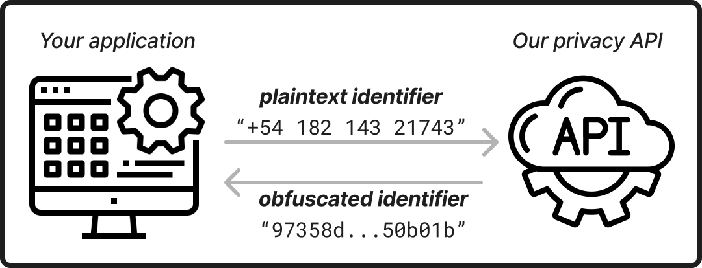

2. Register obfuscated identifier

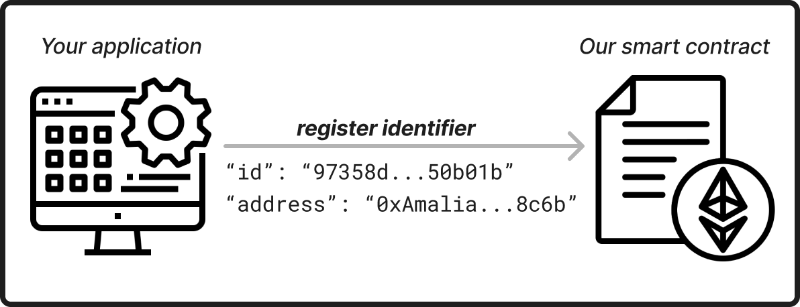 -->

---
## Next steps

+	Learn more: [socialconnect.dev](https://www.socialconnect.dev/)
+	Join: ETHGlobal Paris hackathon
+	Find me: [@0xarthurxyz](https://twitter.com/0xarthurxyz)

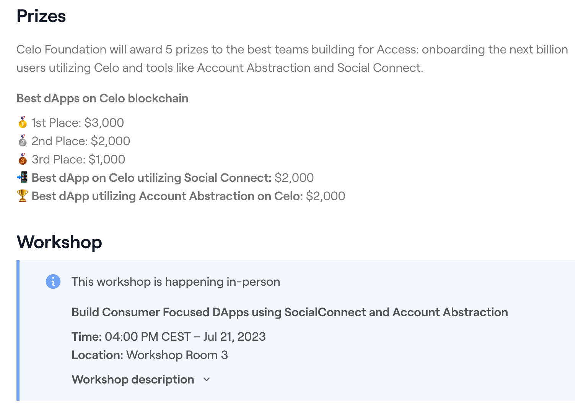

---
## Appendix

---
## SocialConnect Mapping

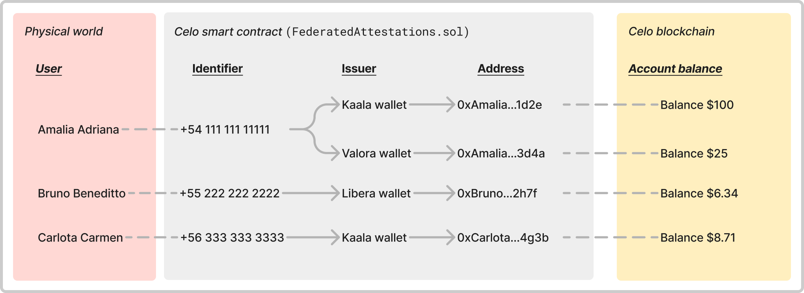

---
## 1 - Obfuscate


Our **privacy** API lets developers obfuscate identifiers while maintaining **interoperability** across applications.

---
## 2 - Register


Our SDK gives developers complete **freedom** to design **verification** flows and **register** identifiers.

---
## 3 - Search

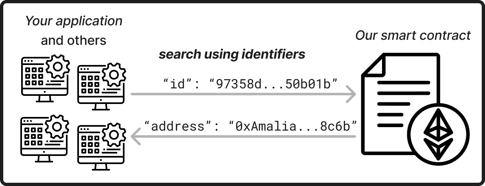

Our SDK lets developers design **delightful** and intuitive **user experiences**.

---
## Metamask

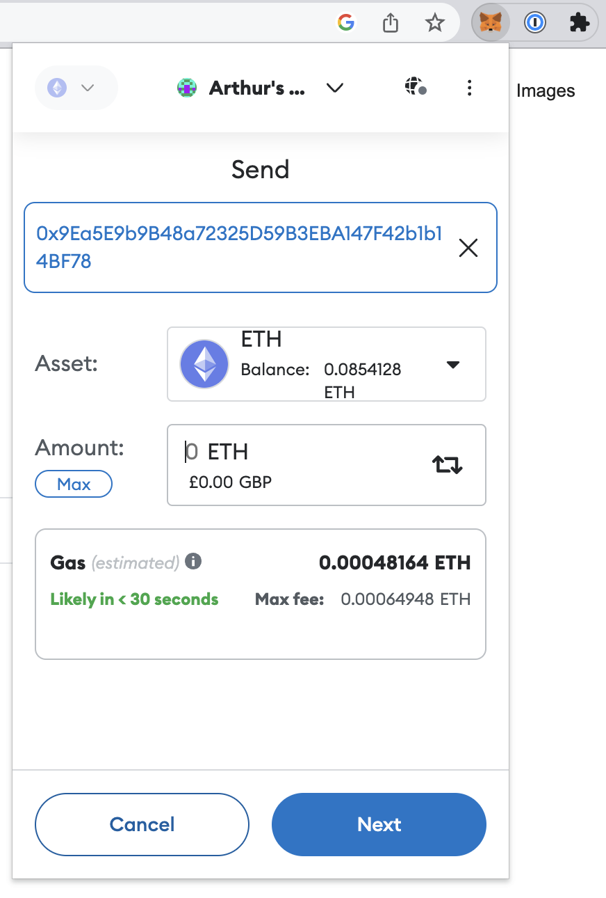

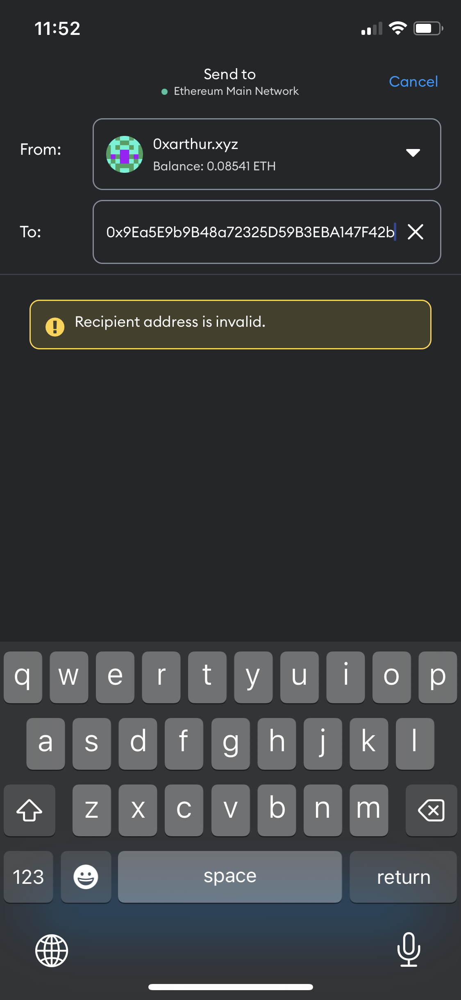

---
## Ledger

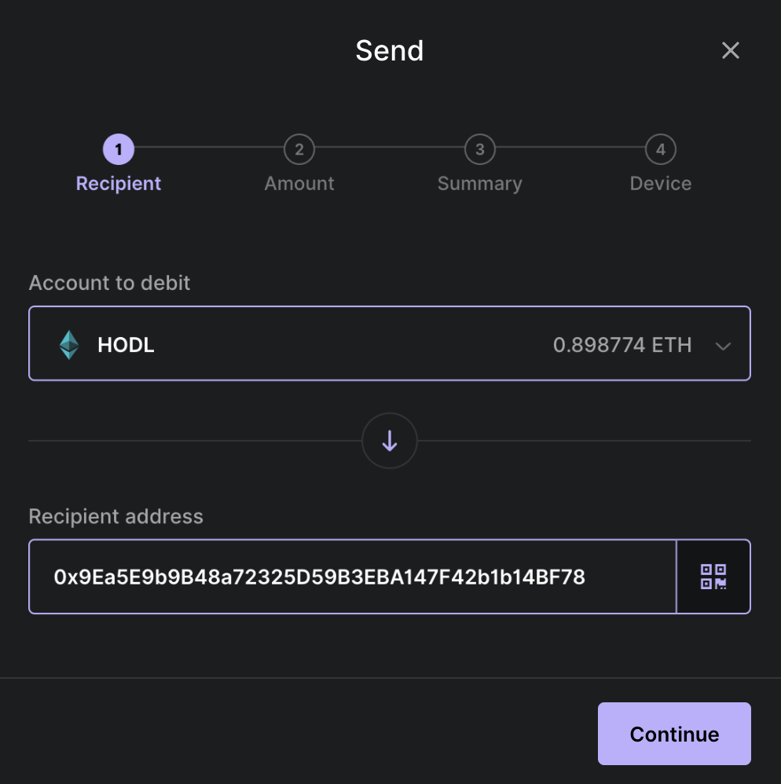

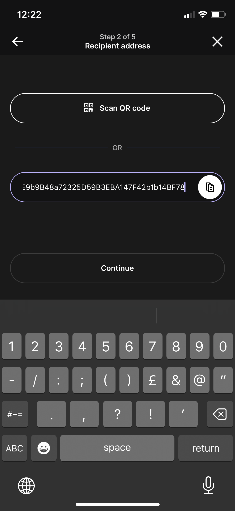

---

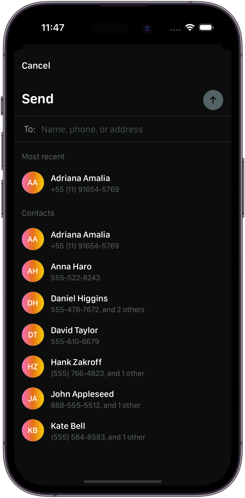

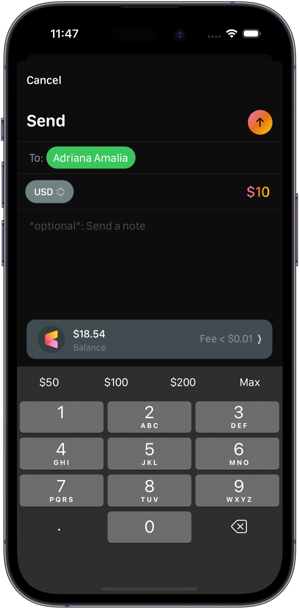

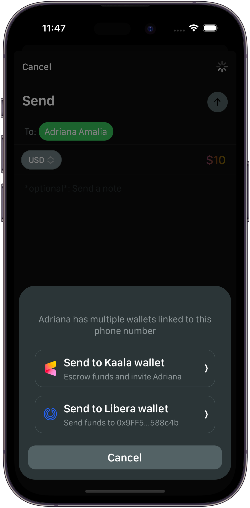

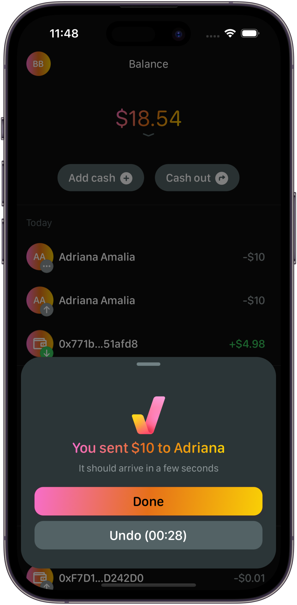